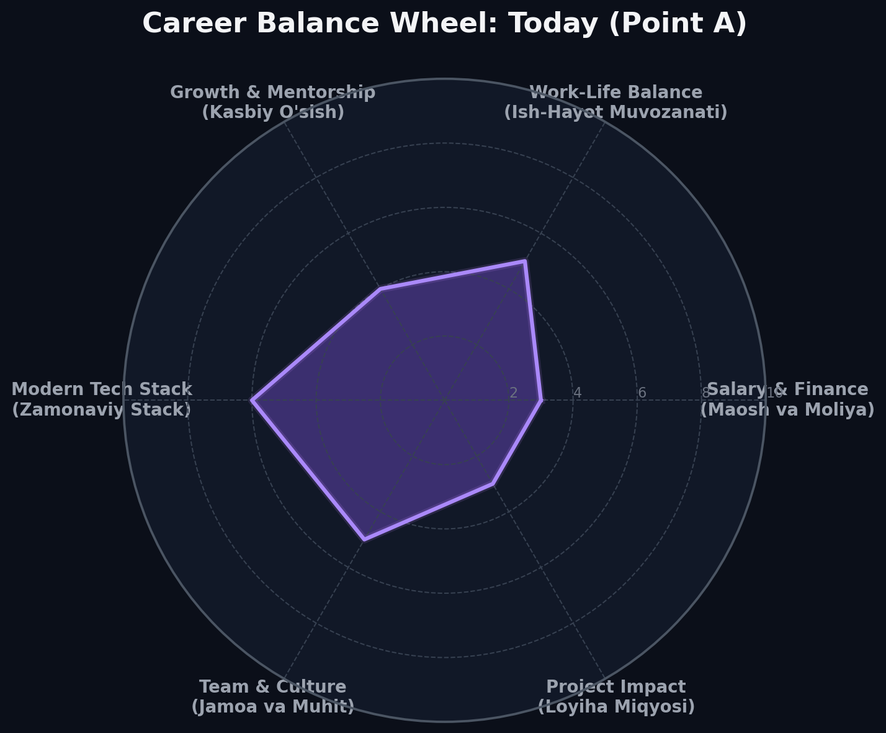
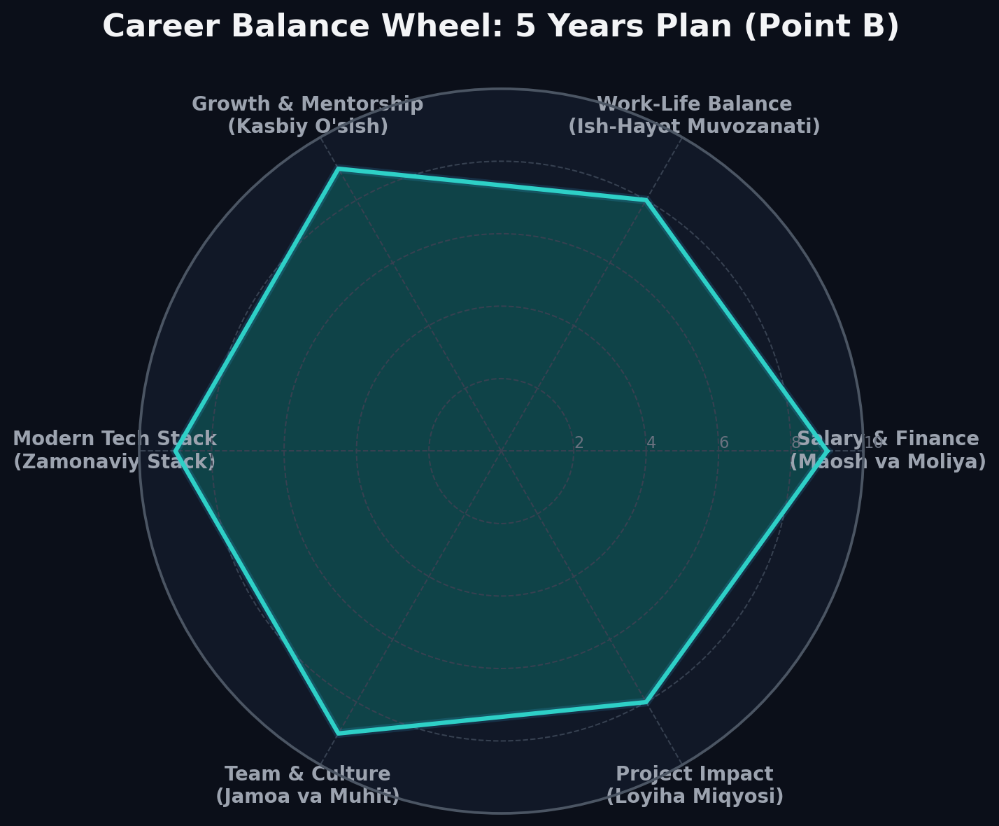

# Career Track — Project 00: Career Trajectory & Goals

This project maps out my professional trajectory for the next 3 to 5 years. It identifies key values, evaluates core career priorities, and lays out a concrete plan to move from my current student status to a highly accomplished engineering role.

---

## Exercise 00: The Career Balance Wheel

To understand my job selection priorities, I have defined **six core criteria** that matter most to my career fulfillment. Below is an analysis of each criterion, including its current state (Point A), target state (Point B), and the action plan to close the gap.

### 1. Salary & Financial Growth (Maosh va Moliya)
* **Current Score:** `3 / 10`
  * *Status:* As a student at School 21, my primary income is from occasional freelance work and academic achievements. My budget is limited, and financial independence is one of my high-priority goals.
* **Target Score:** `9 / 10`
  * *Objective:* Secure a high-income position with a stable monthly base of $4,000–$4,500 USD, along with performance-based bonuses, healthcare, and professional development budgets.
* **Action Steps:**
  1. Complete the School 21 curriculum with outstanding projects.
  2. Build a stellar portfolio showing production-ready full-stack applications.
  3. Master system design, database indexing, and advanced high-load architectures.
  4. Perform salary negotiation research and interview training to articulate my market value confidently.

### 2. Work-Life Balance & Remote Work (Ish-Hayot Muvozanati)
* **Current Score:** `5 / 10`
  * *Status:* The educational environment is highly flexible but demanding. Studies often require late-night coding sessions, occasionally compromising sleep and personal routine.
* **Target Score:** `8 / 10`
  * *Objective:* Work in a hybrid or fully remote setting with flexible working hours, clear boundaries between personal life and professional work, and ample time for physical health and hobbies.
* **Action Steps:**
  1. Set up strict personal time-blocks for daily work, learning, and rest using tools like Todoist or Trello.
  2. Target modern tech companies known for asynchronous work models and high trust cultures.
  3. Integrate regular physical exercise and mindfulness habits into my weekly routine.

### 3. Professional Growth & Mentorship (Kasbiy O'sish)
* **Current Score:** `4 / 10`
  * *Status:* Learning is self-directed and peer-to-peer. While this builds exceptional problem-solving skills, I lack direct, structured guidance from Senior Engineers or Tech Leads on commercial platforms.
* **Target Score:** `9 / 10`
  * *Objective:* Work in an engineering organization with a strong culture of mentoring, continuous learning, and active peer-review practices (regular 1-on-1s, technical workshops, company-sponsored training).
* **Action Steps:**
  1. Filter out companies that lack a dedicated engineering mentoring program during my job hunt.
  2. Find and connect with experienced developers on LinkedIn/local IT communities to seek advice.
  3. Actively seek constructive code reviews on open-source and personal projects.
  4. Participate in technical write-ups, dev meetups, and conferences.

### 4. Modern Tech Stack (Zamonaviy Stack)
* **Current Score:** `6 / 10`
  * *Status:* Strong foundation in Python (Django, Flask, PostgreSQL) and JavaScript (React, Next.js, HTML/CSS, Docker). However, I need hands-on experience with cloud platforms, microservices, and distributed state management.
* **Target Score:** `9 / 10`
  * *Objective:* Master advanced scalable tech stacks, including Go or Python microservices, Kubernetes, CI/CD pipelines (GitHub Actions, GitLab CI), AWS/GCP, and modern frontend engines.
* **Action Steps:**
  1. Design and deploy a complex, containerized multi-container app using Docker Compose, PostgreSQL, Redis, and a Next.js front-end.
  2. Gain fundamental certifications in cloud technologies (AWS Certified Cloud Practitioner or similar).
  3. Study system design concepts (horizontal scaling, load balancing, caching strategies, message queues like RabbitMQ/Kafka).

### 5. Team & Culture (Jamoa va Muhit)
* **Current Score:** `5 / 10`
  * *Status:* Peer learning at School 21 provides a collaborative environment, but I have yet to experience working inside a professional, multidisciplinary agile product team with dedicated Product Owners, Designers, and DevOps.
* **Target Score:** `9 / 10`
  * *Objective:* Belong to a supportive, high-trust team of curious, open-minded engineers where healthy communication, blameless post-mortems, and agile practices are the norm.
* **Action Steps:**
  1. Ask targeted questions about team dynamics, psychological safety, and day-to-day agile workflows during interviews.
  2. Improve soft skills like empathetic communication, technical writing, and peer feedback.
  3. Engage in collaborative coding challenges, hackathons, and team projects.

### 6. Project Impact (Loyiha Miqyosi)
* **Current Score:** `3 / 10`
  * *Status:* Most works are academic sandboxes, local scripts, and administrative UI adjustments. They solve temporary requirements rather than real production loads.
* **Target Score:** `8 / 10`
  * *Objective:* Develop software that serves thousands or millions of active users, directly contributing to core business value or solving large-scale societal/ecological challenges.
* **Action Steps:**
  1. Prioritize mid-sized product companies and high-growth SaaS startups during job selection.
  2. Build and maintain open-source packages or community-driven utility apps.
  3. Study how product metrics (DAU, MAU, conversion rates) relate to technical decisions.

---

### Visualizations of the Career Balance Wheel

Below are the visual radar charts illustrating my progress from my current state (Point A) to my desired target state in 5 years (Point B).

| Career Balance Wheel: Today (Point A) | Career Balance Wheel: 5 Years Plan (Point B) |
| :---: | :---: |
|  |  |

---

## Exercise 01: Career Goals Table

The table below outlines my career planning path, comparing my current status today (Point A) with my desired state in 5 years (Point B), leaving the intermediate period open to be planned after market analysis and self-reflection exercises.

| Today (Point A) | 2-3 Years | Career Goal (Point B) — 5 Years |
| :--- | :--- | :--- |
| **Current Career Status:** • Full-time Software Engineering student at School 21. • Occasional freelance web developer.  **Current Skills & Knowledge:** • Core Languages: Python, JavaScript, HTML, CSS. • Frameworks: Django, React. • Tooling & Infra: Docker, Git, Linux Shell, PostgreSQL, Redis.  **Available Resources:** • Highly collaborative peer-learning community. • Mentorship opportunities within local dev clubs. • Strong educational materials on system engineering. • High motivation and continuous learning habit. | | **Desired Position & Role:** • Senior Full-Stack Engineer or Tech Lead / Software Architect in a fast-growing tech product company.  **Aesthetics & Value System:** • Strong focus on remote-first culture, high professional autonomy, and intellectual freedom. • Balanced work-life boundary with flexible time commitments.  **Technical & Professional Goals:** • Expert in microservices architecture, system scaling, cloud computing (AWS/GCP), and advanced CI/CD pipelines. • Skilled in guiding, mentoring, and leading a cross-functional squad of 4–6 talented developers.  **Financial Target:** • $4,500 USD per month plus equity/bonuses and premium health perks. |

---
